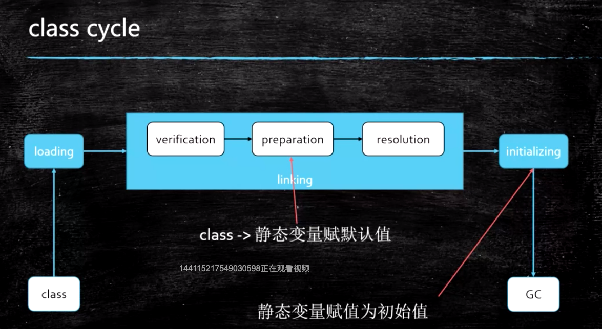
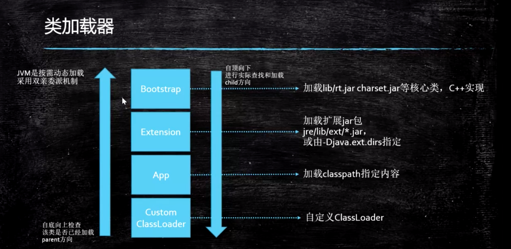
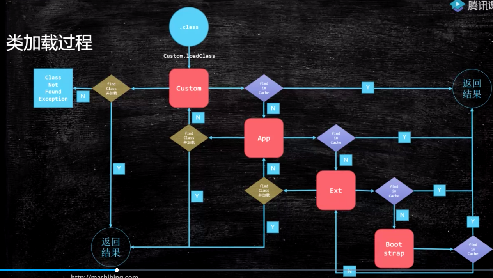
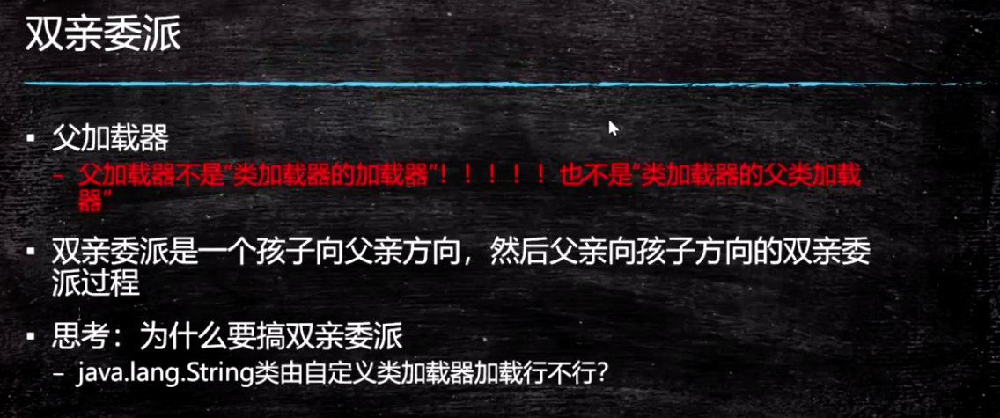
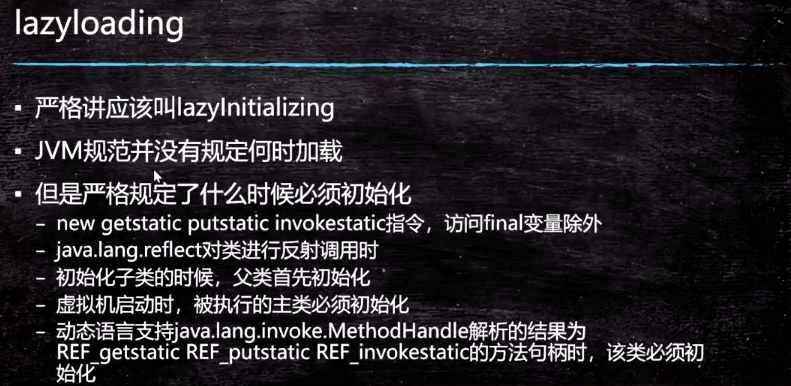
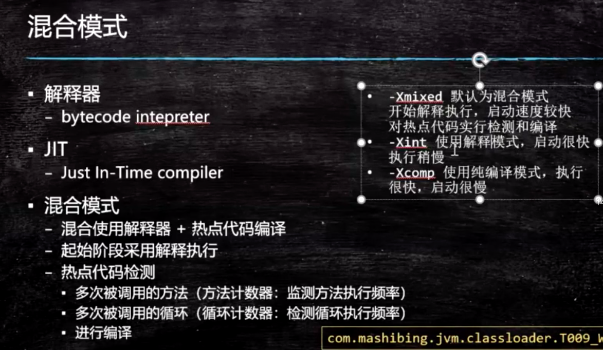

## 3：类加载-初始化

1. 加载过程

   1. Loading（加载到内存）
      
      1. 通过类加载器（本身也是class）加载各种类，进了内存后两部分：生成class对象（metaspace）-> （指向）二进制文件； 
      
         
      
         类的层次没有继承关系 （网络上的图 实际会混淆）只是语法上；
      
         加载类的时候，实际是在实现上委托给父类加载器（代码里关联，做一个定义）；
      
         bootstrap是c++实现的，返回的是null，java没有类和它对应，看到null代表已经到头了;
      
         加载类加载器的class loader是null，用上述来理解这件事
      
         
      
         加载过程 ： 双亲委派，主要出于安全来考虑,性能其次
      
         N型回路加载过程（看图） 自定义class loader 先从缓存里找，没有去父class loader里找；很重要
      
         
      
         
      
      2. LazyLoading 五种情况[懒加载 需要的时候才去加载] 了解即可，没必要去强记
      
         1. –new getstatic putstatic invokestatic指令，访问final变量除外
      
            –java.lang.reflect对类进行反射调用时
      
            –初始化子类的时候，父类首先初始化
      
            –虚拟机启动时，被执行的主类必须初始化
      
            –动态语言支持java.lang.invoke.MethodHandle解析的结果为REF_getstatic REF_putstatic REF_invokestatic的方法句柄时，该类必须初始化
            
            
      
          规范没有要求何时去加载，虚拟机启动的时候把所有的class加载好，有这个必要么？可以这么做，但肯定没必要。
      
      3. ClassLoader的源码
      
         1. findInCache -> parent.loadClass -> findClass()
      
      4. 自定义类加载器
      
         1. extends ClassLoader
         2. overwrite findClass() -> defineClass(byte[] -> Class clazz) [指定目录地址去加载class]
         3. **用途：加密，保护不被反编译**
         4. 问题：parent是如何指定的，打破双亲委派，学生问题（ha sh code 计算存储在哪 涉及偏向锁）
            
            1. 用super(parent)指定
            2. 双亲委派的打破
               1. 如何打破：（必须一定）重写loadClass（）+ 自定义classloader 不同的实例
               2. 何时打破过？
                  1. JDK1.2之前，自定义ClassLoader都必须重写loadClass()
                  
                  2. 线程上下文级别，ThreadContextClassLoader可以实现基础类调用实现类代码，通过thread.setContextClassLoader指定
                  
                  3. 热启动，热部署（模块化）- 实际用途很多
                     
                     1. osgi tomcat 都有自己的模块指定classloader（可以加载同一类库的**不同版本**）
                     
                     tomcat的方案是 啥？看源码
                     
                     被取代的classloader + class对象，暂时还在metaspace里， 在未来会被GC
      
      5. 混合执行（默认方式） 编译执行 解释执行
      
         1. 检测热点代码：-XX:CompileThreshold = 10000
         
            
      
   2. Linking 
      1. Verification
         1. 验证文件是否符合JVM规定
      2. Preparation
         1. 静态成员变量赋**默认值**
      3. Resolution （解析）
         1. 将类、方法、属性等**<u>符号引用解析为直接引用</u>**
            常量池中的各种符号引用解析为指针、偏移量等内存地址的直接引用
      
   3. Initializing

      1. 调用类初始化代码 <clinit>，应该也包括静态代码块逻辑处理，给静态成员变量赋**初始值**

2. 小总结：

   1. load - 默认值 - 初始值
   2. new 出一个对象时- 给对象申请内存 ， 对象的属性赋值过程： 默认值 -> 初始值

   引申出来一个问题 单例模式的实现 双重检验 new 赋值（指令重排 完成指向时 还没有分配）