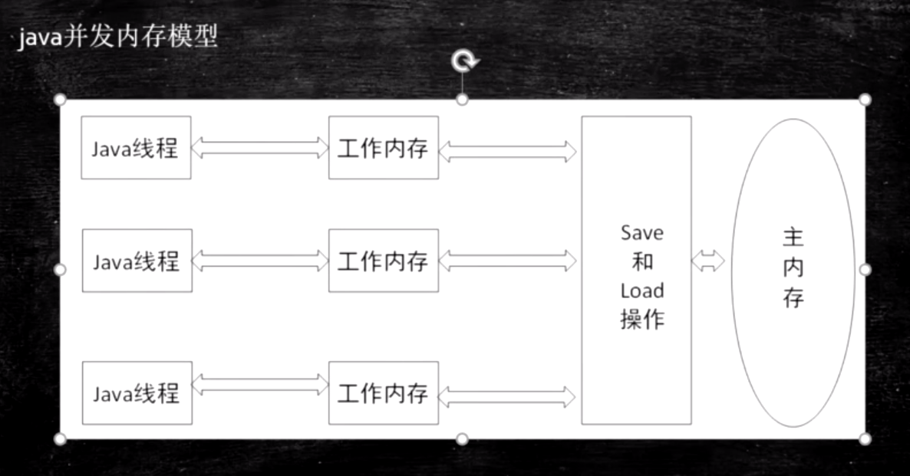
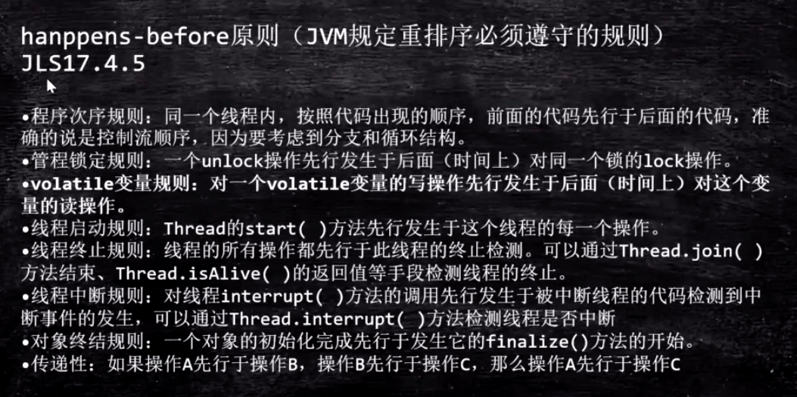
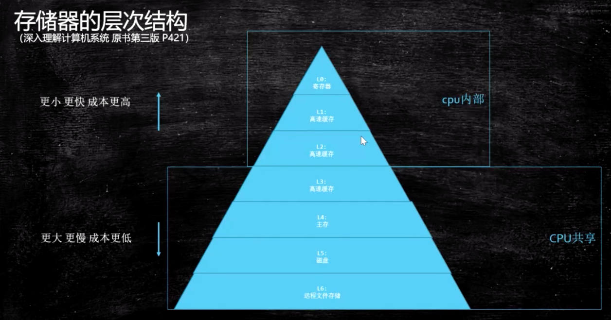
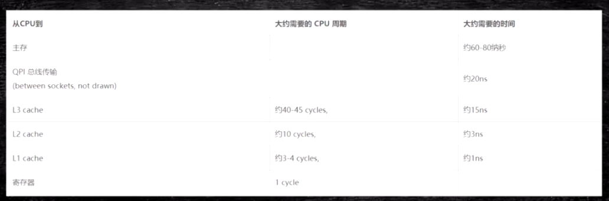
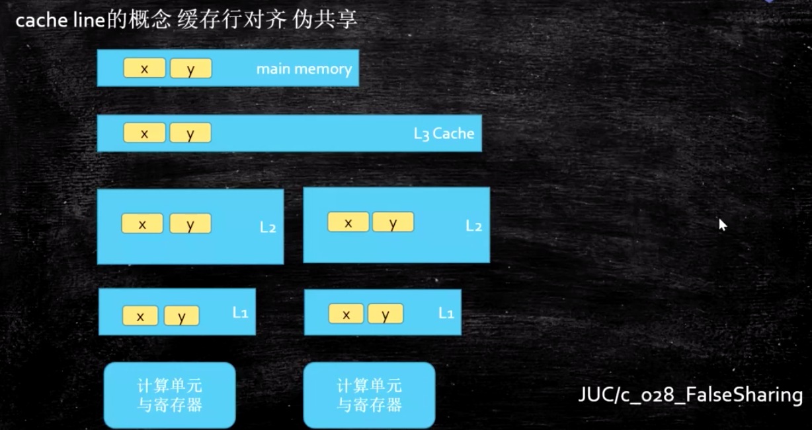
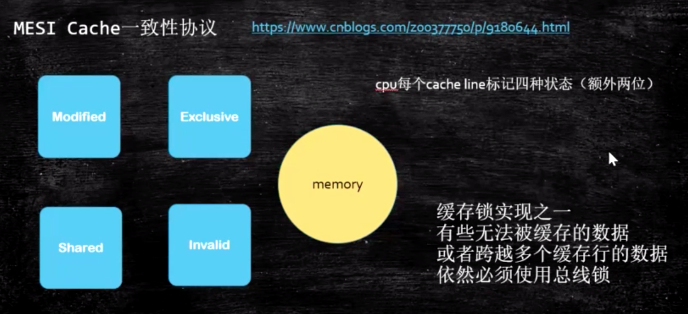
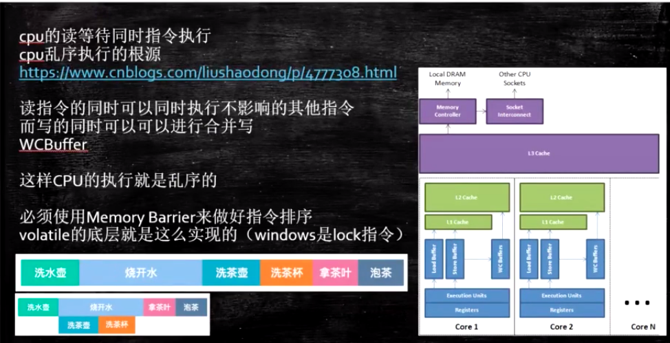
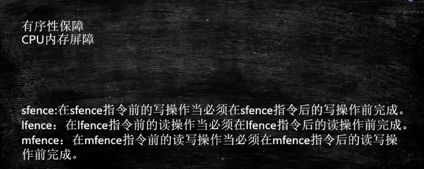
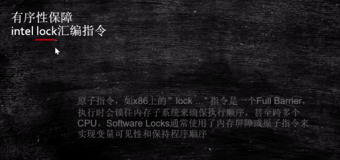
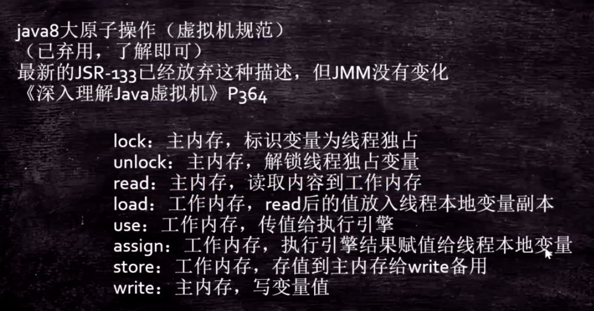

# JMM [java 内存管理]

### java并发内存模型

看图 java并发内存模型

 每一个java线程都有自己的一个工作内存（显然也是在物理内存中），与此同时有划分出来的主内存，作为所有线程共享的内存区域；

### happens-before 原则 （JLS规范要求 重排序必须遵守的规则）

java语言的规范，具体实现看jvm

### 存储器结构

CPU 比 mem 快100倍

存储速度 呈金字塔模式

使用缓存会产生问题

看上图

L3是所有CPU共享的，L1 & L2 是CPU隔离的

会产生一致性问题，如何解决？

## 硬件层数据一致性

Bus Lock 总线锁 （不应该被锁的CPU也不能工作）-- 比较古老的CPU只采用这一种方式

各种各样的协议，很多

intel 用MESI 缓存数据的四种状态 占用2bit

https://www.cnblogs.com/z00377750/p/9180644.html

现代CPU的数据一致性实现 = 缓存锁(MESI ...) + 总线锁

CPU处理时，读取缓存以cache line为基本单位，目前64bytes

位于同一缓存行的两个不同数据，被两个不同CPU锁定，产生互相影响的伪共享问题

伪共享问题：JUC/c_028_FalseSharing

使用缓存行的对齐能够提高效率

## 乱序问题

CPU为了提高指令执行效率，会在一条指令执行过程中（比如去内存读数据（慢100倍）），去同时执行另一条指令，前提是，两条指令没有依赖关系

https://www.cnblogs.com/liushaodong/p/4777308.html

写操作也可以进行合并

https://www.cnblogs.com/liushaodong/p/4777308.html

JUC/029_WriteCombining （这个例子逆天了）  合并写 会使用wcbuffer 比L1还要快，但只有4 Byte

乱序执行的**证明**：JVM/jmm/Disorder.java

原始参考：https://preshing.com/20120515/memory-reordering-caught-in-the-act/

如何修改这个程序让其不乱序？

## 如何保证特定情况下不乱序（有序性保障）

##### 硬件：CPU级别的内存屏障 

X86 不同厂商的CPU指令不一样 逻辑也不一样

>  sfence:  store| 在sfence指令前的写操作当必须在sfence指令后的写操作前完成。
>  lfence：load | 在lfence指令前的读操作当必须在lfence指令后的读操作前完成。
>  mfence：modify/mix | 在mfence指令前的读写操作当必须在mfence指令后的读写操作前完成。

> 原子指令，如x86上的”lock …” 指令是一个Full Barrier，执行时会锁住内存子系统来确保执行顺序，甚至跨多个CPU。Software Locks通常使用了内存屏障或原子指令来实现变量可见性和保持程序顺序
>
> 
>
> 

##### JVM级别如何规范（JSR133）

> 最终必然还是要借助硬件去实现
>
> 规范里定义了4种：
>
> LoadLoad屏障：
> 	对于这样的语句Load1; LoadLoad; Load2， 
>
> 	在Load2及后续读取操作要读取的数据被访问前，保证Load1要读取的数据被读取完毕。
>
> StoreStore屏障：
>
> 	对于这样的语句Store1; StoreStore; Store2，
> 	
> 	在Store2及后续写入操作执行前，保证Store1的写入操作对其它处理器可见。
>
> LoadStore屏障：
>
> 	对于这样的语句Load1; LoadStore; Store2，
> 	
> 	在Store2及后续写入操作被刷出前，保证Load1要读取的数据被读取完毕。
>
> StoreLoad屏障：
> 	对于这样的语句Store1; StoreLoad; Load2，
>
> ​	 在Load2及后续所有读取操作执行前，保证Store1的写入对所有处理器可见。

### **volatile的实现细节**

#### 字节码层面

ACC_VOLATILE

#### JVM层面

volatile内存区的读写 都加屏障

   > StoreStoreBarrier
   >
   > volatile 写操作
   >
> StoreLoadBarrier

   > LoadLoadBarrier
   >
   > volatile 读操作
   >
> LoadStoreBarrier
   >
   > 

#### OS和硬件层面

https://blog.csdn.net/qq_26222859/article/details/52235930
hsdis - HotSpot Dis Assembler
windows lock 指令实现 | MESI实现

### synchronized实现细节

#### 1.字节码层面

ACC_SYNCHRONIZED 修饰方法时，在方法上加这条锁标识指令
monitorenter monitorexit 修饰在方法块上时产生 (有两个 其中一个是发生异常时也需要正常退出)

#### 2.JVM层面

C C++ 调用了操作系统提供的同步机制

#### 3.OS和硬件层面

X86 : lock指令，可以锁很多指令，如 cmpxchg / xxx
[https](https://blog.csdn.net/21aspnet/article/details/88571740)[://blog.csdn.net/21aspnet/article/details/](https://blog.csdn.net/21aspnet/article/details/88571740)[88571740](https://blog.csdn.net/21aspnet/article/details/88571740)

## 面试题

见下一节 java内存对象布局

