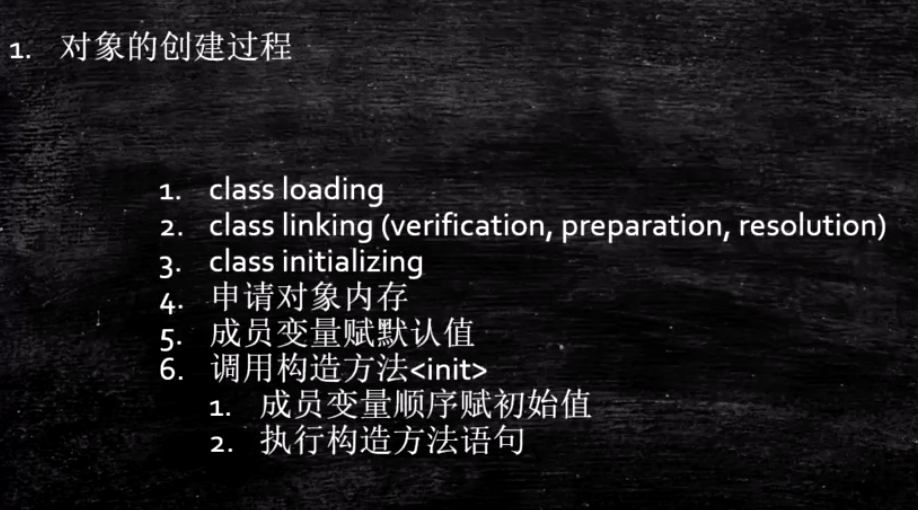

# 使用JavaAgent测试Object的大小

作者：马士兵 http://www.mashibing.com

## 对象的创建过程

从Load class -> 创建对象



## 对象大小（64位机）在内存中的布局

### 观察虚拟机配置

java -XX:+PrintCommandLineFlags -version

### 普通对象

1. 对象头：markword  8字节
2. ClassPointer指针：指向class，-XX:+UseCompressedClassPointers 为4字节 不开启为8字节
3. 实例数据
   1. 引用类型：-XX:+UseCompressedOops 为4字节 不开启为8字节 
      Oops Ordinary Object Pointers（网上很多错误的解释，结合+UseCompressedClassPointers来对比）
4. Padding对齐，使其整个对象长度为8字节的倍数

### 数组对象

1. 对象头：markword 8
2. ClassPointer指针同上
3. 数组长度：4字节
4. 数组数据
5. 对齐 8字节的倍数


## Agent 代理机制

class从磁盘加载到jvm(内存)过程中代理拦截，可以直接改class字节码


## 实验

1. 新建项目ObjectSize （1.8）

2. 创建文件ObjectSizeAgent

   ```java
   package com.mashibing.jvm.agent;
   
   import java.lang.instrument.Instrumentation;
   
   public class ObjectSizeAgent {
       private static Instrumentation inst;
   		//固定方法名 参数格式
       public static void premain(String agentArgs, Instrumentation _inst) {
           inst = _inst;
       }
   		/**
   		目的就是为了拿到instrumentation实例
   		**/
       public static long sizeOf(Object o) {
           return inst.getObjectSize(o);
       }
   }
   ```

3. src目录下创建META-INF/MANIFEST.MF

   ```java
   Manifest-Version: 1.0
   Created-By: mashibing.com
   Premain-Class: com.mashibing.jvm.agent.ObjectSizeAgent
   ```

   注意Premain-Class这行必须是新的一行（回车 + 换行），确认idea不能有任何错误提示

4. 打包jar文件

5. 在需要使用该Agent Jar的项目中引入该Jar包
   project structure - project settings - library 添加该jar包

6. 运行时需要该Agent Jar的类，加入参数：

   ```java
   -javaagent:C:\work\ijprojects\ObjectSize\out\artifacts\ObjectSize_jar\ObjectSize.jar
   ```

7. 如何使用该类：

   ```java
   ​```java
      package com.mashibing.jvm.c3_jmm;
      
      import com.mashibing.jvm.agent.ObjectSizeAgent;
      
      public class T03_SizeOfAnObject {
          public static void main(String[] args) {
              System.out.println(ObjectSizeAgent.sizeOf(new Object()));
              System.out.println(ObjectSizeAgent.sizeOf(new int[] {}));
              System.out.println(ObjectSizeAgent.sizeOf(new P()));
          }
      
          private static class P {
                              //8 _markword
                              //4 _oop指针
              int id;         //4
              String name;    //4
              int age;        //4
      
              byte b1;        //1
              byte b2;        //1
      
              Object o;       //4
              byte b3;        //1
      
          }
      }
   ```

## Hotspot开启内存压缩的规则（64位机）

1. 4G以下，直接砍掉高32位
2. 4G - 32G，默认开启内存压缩 ClassPointers Oops
3. 32G，压缩无效，使用64位
   内存并不是越大越好（^-^）


根据锁的状态（2bit）偏向锁（1bit）来分配其他位置

年龄 4bit 所以最大15

## IdentityHashCode的问题

问题：

当一个对象计算过identityHashCode之后，不能进入偏向锁状态 

对的，看上面图，偏向锁101，在设置线程ID时需要的位置 被hash code占用了

https://cloud.tencent.com/developer/article/1480590
 https://cloud.tencent.com/developer/article/1484167

https://cloud.tencent.com/developer/article/1485795

https://cloud.tencent.com/developer/article/1482500

## 对象定位

•https://blog.csdn.net/clover_lily/article/details/80095580

1. 句柄池 中间多一个class pointer [访问时效率略低 ，GC时高效]
2. 直接指针 hotspot使用这个 直接指向内存对象[访问时高效 ，GC时略低效]

new 出来的对象怎么去和声明的变量关联


## 对象分配过程

