# Runtime Data Area（运行时数据区） and Instruction Set（汇编指令集）

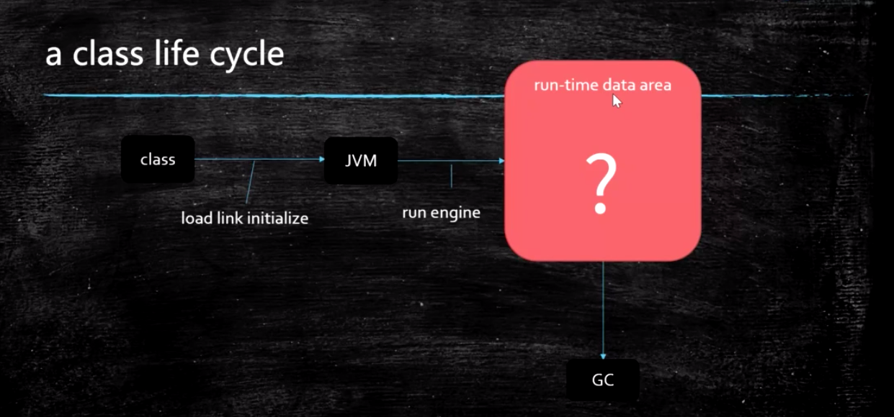

jvms 2.4 2.5

## 指令集分类

1. 基于寄存器的指令集
2. 基于栈的指令集
   Hotspot中的Local Variable Table = JVM中的寄存器

## Runtime Data Areas

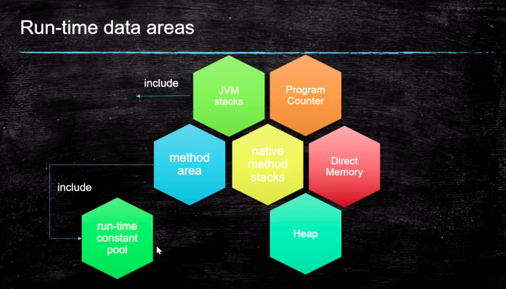

## PC 程序计数器

每一个jvm的线程有它自己的一个PC

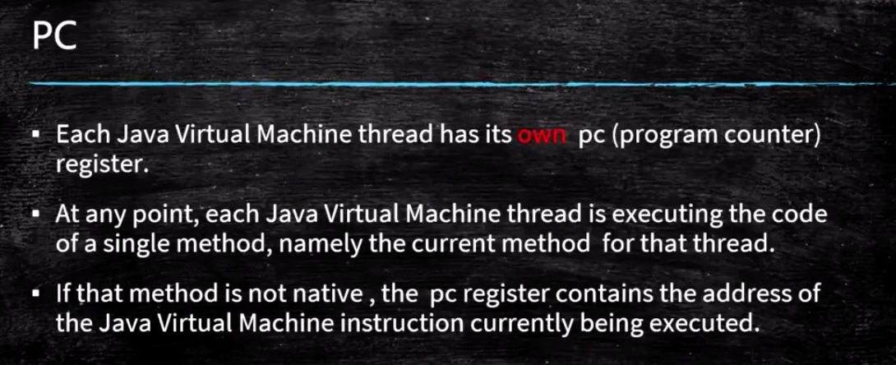

> 存放指令位置
>
> 虚拟机的运行，类似于这样的循环：
>
> while( not end ) {
>
> ​	取PC中的位置，找到对应位置的指令；
>
> ​	执行该指令；
>
> ​	PC ++;
>
> }

## JVM Stack 线程栈

jvm层面管理的，一个线程一个栈

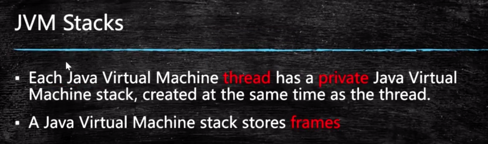

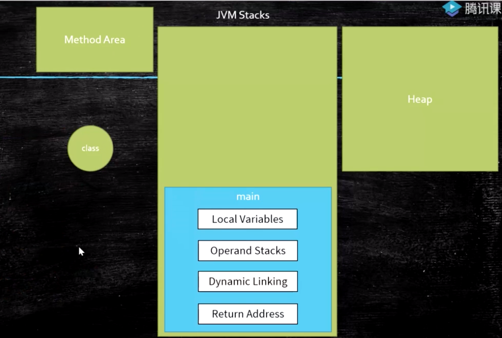

从一个线程栈来看，运行时需要 从方法区（method area）取class描述，去heap拿对象数据 压栈出栈

### 1.Frame 栈帧

每个方法对应一个栈帧

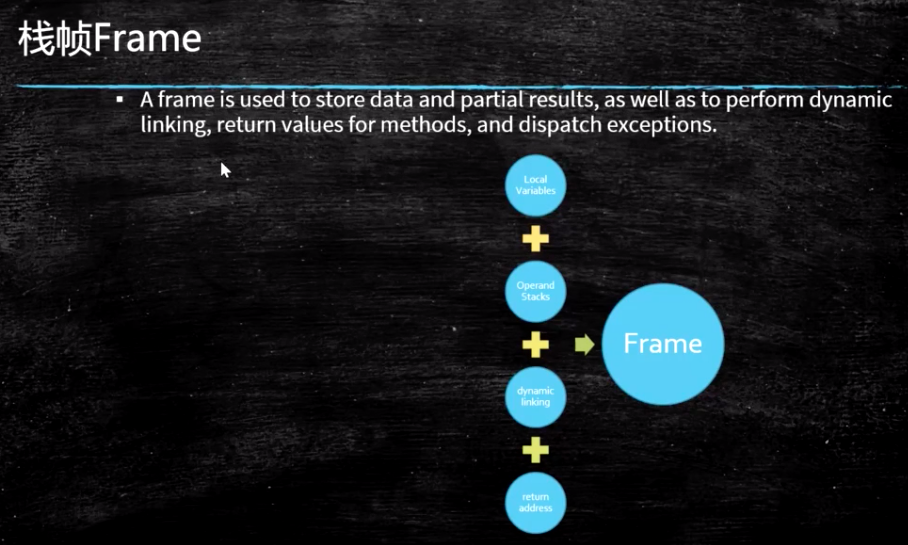

包含以下4个部分内容：

1. Local Variable Table 局部变量表
2. Operand Stack 操作数栈 每一个方法栈帧有一个
   对于long的处理（store and load），多数虚拟机的实现都是原子的
   jls 17.7，没必要加volatile
3. Dynamic Linking
    https://blog.csdn.net/qq_41813060/article/details/88379473 
   jvms 2.6.3
4. return address
   a() -> b()，方法a调用了方法b, b方法的返回值放在什么地方

补充：设计 CPU 指令集

- 基于栈的指令集
- 基于寄存器的指令集

hotspot 采用了局部变量表 近似于寄存器指令集方式

最终从硬件上来看 必然是基于寄存器

### 2 例子

(1) this

重点看下this

非静态方法会多出来一个this[0号位置上] 在本地变量表

(2) 计算

iadd 4+3,得到7 放栈顶

（3） 静态方法调用非静态方法

（4）递归方法

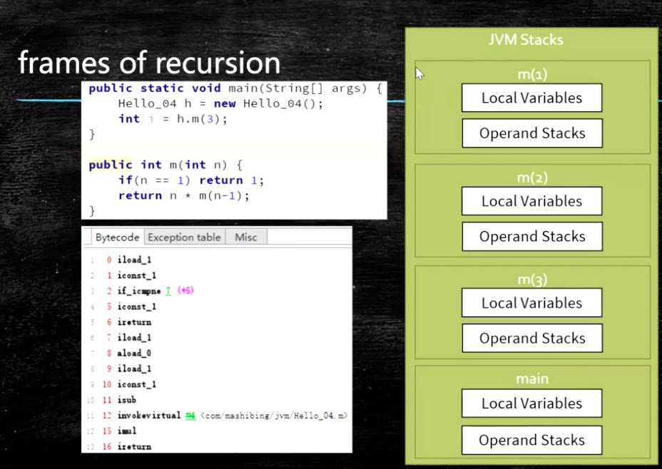

不同的参数值逐一压入栈

## Heap 堆

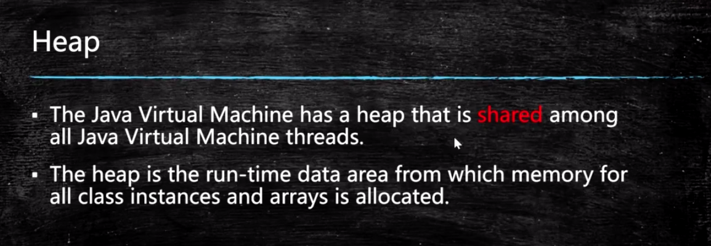

## Method Area（方法区 逻辑概念）

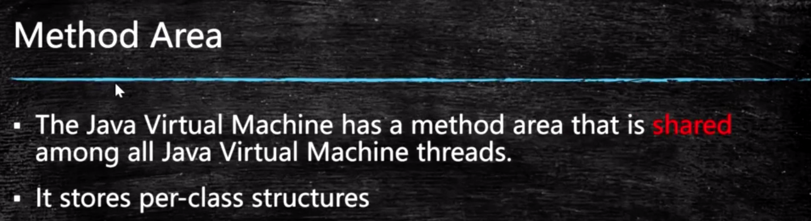

1. Perm Space (<1.8) 方法区具体的实现
   
   class 对象
   
   字符串常量位于PermSpace
   FGC不会清理
   大小启动的时候指定，不能变
   
2. Meta Space (>=1.8) 方法区的实现
   字符串常量位于堆heap
   会触发FGC清理
   不设定的话，最大就是物理内存

Runtime Constant Pool 运行时常量池，class对象里的常量池

Native Method Stack 本地方法栈

Direct Memory 直接内存

> JVM可以直接访问的内核空间的内存 (OS 管理的内存)
>
> NIO 基于直接内存操作， 提高效率，实现zero copy；BIO有内存拷贝过程

思考：

> 如何证明**字符串常量**在1.7位于Perm，而1.8位于Heap？
>
> 提示：结合GC， 一直创建字符串常量，观察堆，和Metaspace

## 线程共享区域

共享区：堆 + 方法区

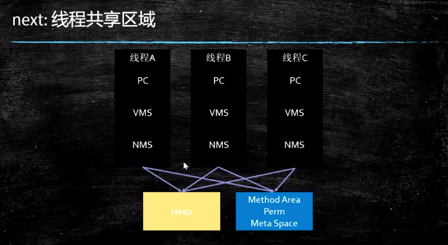

## 常用指令

store

load

pop

mul

sub

invoke

1. InvokeStatic
2. InvokeVirtual 绝大部分是多态方法 or final
3. InvokeInterface
4. InovkeSpecial
   可以直接定位，不需要多态的方法
   private 方法 ， 构造方法
5. InvokeDynamic
   JVM最难的指令
   lambda表达式或者反射或者其他动态语言scala kotlin，或者CGLib ASM，动态产生的class，会用到的指令

  lambda表达式 实际是一个函数指针，对象是内部类的内部类  $lambda.$

动态：运行时产生的class

for/while循环体里使用lambda，产生大量的class 放在方法区，可能会撑爆内存；

方法区产生动态class，小于1.8 FGC不回收[重大bug]；>= 1.8GC会回收

小结：

<clinit> - class init类的静态块初始化

<init> 对象的初始化

## 面试题

 bipush 压栈

istore 出栈

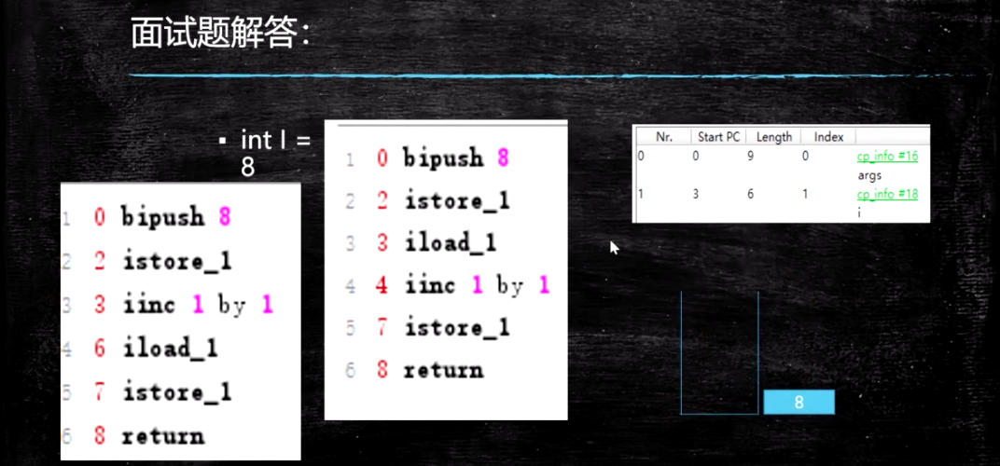